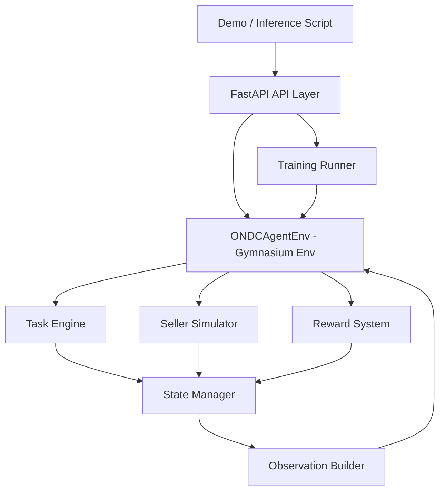
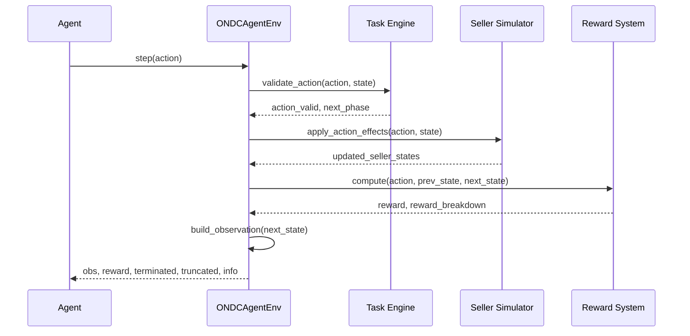
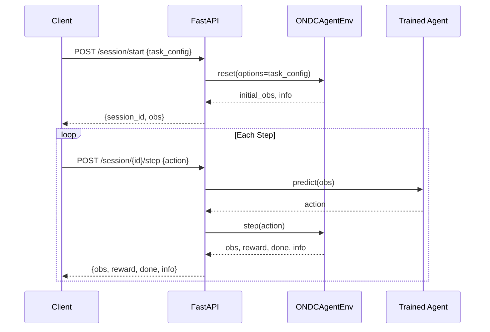

# Design Document: ONDCAgentEnv

## Overview

ONDCAgentEnv is a reinforcement learning environment that simulates the ONDC (Open Network for Digital Commerce) buyer-seller lifecycle. An RL agent acts as a buyer navigating the full Beckn protocol flow — SEARCH → SELECT → INIT → CONFIRM → TRACK → CANCEL/RETURN — optimizing decisions across multi-seller markets with dynamic pricing, stock changes, and real-world constraints like budget, delivery urgency, and seller ratings.

The system is designed for rapid hackathon development (3–5 days) with a FastAPI backend, a Gymnasium-compatible RL environment, modular reward shaping, and a demo-ready inference script. The architecture is intentionally layered so each module can be developed and tested independently before integration.

## Architecture



## Sequence Diagrams

### Agent Step Cycle



### API-Driven Inference Flow




## Components and Interfaces

### Component 1: ONDCAgentEnv (RL Environment)

**Purpose**: Gymnasium-compatible environment wrapping the full ONDC lifecycle simulation.

**Interface**:
```python
class ONDCAgentEnv(gymnasium.Env):
    metadata = {"render_modes": ["human", "json"]}

    def __init__(self, config: EnvConfig) -> None: ...

    def reset(
        self,
        seed: int | None = None,
        options: dict | None = None
    ) -> tuple[ObsDict, InfoDict]: ...

    def step(
        self,
        action: np.ndarray
    ) -> tuple[ObsDict, float, bool, bool, InfoDict]: ...

    def render(self) -> str | None: ...

    def close(self) -> None: ...
```

**Responsibilities**:
- Maintain episode state machine (current Beckn phase)
- Delegate action validation to Task Engine
- Delegate seller state updates to Seller Simulator
- Delegate reward computation to Reward System
- Build and return flattened observation vectors

---

### Component 2: Task Engine

**Purpose**: Enforces Beckn protocol phase transitions and validates agent actions.

**Interface**:
```python
class TaskEngine:
    def __init__(self, phases: list[BecknPhase]) -> None: ...

    def validate_action(
        self,
        action: Action,
        state: EpisodeState
    ) -> ValidationResult: ...

    def transition(
        self,
        current_phase: BecknPhase,
        action: Action
    ) -> BecknPhase: ...

    def is_terminal(self, state: EpisodeState) -> bool: ...
```

**Responsibilities**:
- Define valid actions per phase (e.g., can only CONFIRM after INIT)
- Return invalid-action penalty signal when agent violates protocol
- Detect terminal conditions (order confirmed, cancelled, returned, budget exhausted)

---

### Component 3: Seller Simulator

**Purpose**: Simulates N sellers with dynamic pricing, stock, ratings, and random events.

**Interface**:
```python
class SellerSimulator:
    def __init__(self, n_sellers: int, config: SellerConfig) -> None: ...

    def reset(self, seed: int | None = None) -> list[SellerState]: ...

    def get_catalog(
        self,
        query: SearchQuery
    ) -> list[SellerOffer]: ...

    def apply_selection(
        self,
        seller_id: str,
        item_id: str,
        quantity: int
    ) -> SelectResult: ...

    def tick(self) -> list[SellerEvent]: ...  # advance time, emit random events
```

**Responsibilities**:
- Maintain per-seller inventory, price, rating, delivery ETA
- Inject random events: stockouts, price spikes, delivery delays, seller failures
- Respond to SELECT/INIT/CONFIRM with updated offer details

---

### Component 4: Reward System

**Purpose**: Modular, composable reward function with per-component breakdown.

**Interface**:
```python
class RewardSystem:
    def __init__(self, weights: RewardWeights) -> None: ...

    def compute(
        self,
        action: Action,
        prev_state: EpisodeState,
        next_state: EpisodeState
    ) -> RewardResult: ...
```

**Responsibilities**:
- Compute scalar reward from weighted sub-rewards
- Return per-component breakdown for debugging/logging
- Support weight tuning without code changes

---

### Component 5: FastAPI Layer

**Purpose**: HTTP interface for external clients, demo UI, and training orchestration.

**Interface**:
```
POST   /session/start          → {session_id, obs, info}
POST   /session/{id}/step      → {obs, reward, done, info}
GET    /session/{id}/state     → {full_state}
DELETE /session/{id}           → {ok}
POST   /train                  → {run_id}
GET    /train/{run_id}/status  → {status, metrics}
GET    /health                 → {ok}
```

---

### Component 6: Inference Script

**Purpose**: Standalone script to load a trained model and run a full demo episode.

**Interface**:
```python
def run_demo(
    model_path: str,
    task_config: dict,
    render: bool = True,
    max_steps: int = 50
) -> EpisodeResult: ...
```


## Data Models

### State Space (Observation)

The observation is a flat `np.ndarray` (float32) derived from this structured state:

```python
# Full episode state — internal representation
@dataclass
class EpisodeState:
    # --- Task context ---
    task_id: str
    target_item: str                  # product being searched
    budget: float                     # remaining budget
    urgency: float                    # 0.0 (low) to 1.0 (high urgency)
    steps_remaining: int

    # --- Beckn phase ---
    current_phase: BecknPhase         # Enum: SEARCH, SELECT, INIT, CONFIRM, TRACK, POST_ORDER

    # --- Search results (up to MAX_SELLERS=5) ---
    sellers: list[SellerState]        # padded to MAX_SELLERS

    # --- Selected offer ---
    selected_offer: SellerOffer | None

    # --- Order state ---
    order_id: str | None
    order_status: OrderStatus | None  # PENDING, CONFIRMED, SHIPPED, DELIVERED, CANCELLED
    delivery_eta: float               # steps until delivery
    tracking_updates: list[str]

    # --- Episode metrics ---
    total_spent: float
    total_reward: float
    invalid_action_count: int

@dataclass
class SellerState:
    seller_id: str
    name: str
    price: float
    original_price: float
    stock: int
    rating: float                     # 0.0–5.0
    delivery_eta: int                 # steps
    is_available: bool
    discount_pct: float
    fulfillment_type: str             # "standard" | "express" | "same_day"
```

**Flattened observation vector** (shape: `(N_OBS_DIM,)`, dtype: `float32`):

```python
# Observation schema — indices documented for reproducibility
OBS_SCHEMA = {
    # Task context [0:5]
    "budget_normalized":      0,   # budget / initial_budget
    "urgency":                1,
    "steps_remaining_norm":   2,   # steps_remaining / max_steps
    "phase_onehot":           slice(3, 9),   # 6 phases one-hot

    # Per-seller features [9 : 9 + MAX_SELLERS*8]
    # For each seller (padded with zeros if unavailable):
    #   price_norm, rating_norm, eta_norm, stock_norm,
    #   discount_pct, is_available, fulfillment_onehot(3)
    "sellers":                slice(9, 49),  # 5 sellers × 8 features

    # Selected offer [49:55]
    "selected_price_norm":    49,
    "selected_rating_norm":   50,
    "selected_eta_norm":      51,
    "has_selection":          52,

    # Order state [53:58]
    "order_status_onehot":    slice(53, 58), # 5 statuses one-hot

    # Episode metrics [58:61]
    "total_spent_norm":       58,
    "invalid_action_ratio":   59,
    "delivery_eta_norm":      60,
}
N_OBS_DIM = 61
```

### Action Space

```python
# Discrete action space
class ActionType(IntEnum):
    # Phase: SEARCH
    SEARCH_PRODUCTS = 0

    # Phase: SELECT (one action per seller slot, up to MAX_SELLERS)
    SELECT_SELLER_0 = 1
    SELECT_SELLER_1 = 2
    SELECT_SELLER_2 = 3
    SELECT_SELLER_3 = 4
    SELECT_SELLER_4 = 5

    # Phase: INIT
    INIT_ORDER = 6

    # Phase: CONFIRM
    CONFIRM_ORDER = 7
    CANCEL_BEFORE_CONFIRM = 8

    # Phase: TRACK
    TRACK_ORDER = 9

    # Phase: POST_ORDER
    ACCEPT_DELIVERY = 10
    CANCEL_ORDER = 11
    RETURN_ITEM = 12
    FILE_GRIEVANCE = 13

    # Universal
    WAIT = 14  # skip step (costs time penalty)

N_ACTIONS = 15
action_space = gymnasium.spaces.Discrete(N_ACTIONS)
```

### Reward Weights Config

```python
@dataclass
class RewardWeights:
    # Positive signals
    task_completion:    float = 10.0   # confirmed order matching task
    good_price:         float = 2.0    # price below budget * threshold
    fast_delivery:      float = 1.5    # ETA below urgency threshold
    high_seller_rating: float = 1.0    # rating >= 4.0
    successful_return:  float = 3.0    # return/grievance resolved

    # Negative signals
    invalid_action:     float = -1.0   # protocol violation
    budget_exceeded:    float = -5.0   # spent > budget
    order_failed:       float = -3.0   # seller failure / stockout post-confirm
    unnecessary_wait:   float = -0.1   # WAIT action penalty
    late_delivery:      float = -2.0   # ETA exceeded urgency deadline

@dataclass
class RewardResult:
    total: float
    breakdown: dict[str, float]        # component → value
    info: dict[str, Any]
```

### Config Models

```python
@dataclass
class EnvConfig:
    max_steps: int = 50
    n_sellers: int = 5
    initial_budget: float = 1000.0
    urgency_range: tuple[float, float] = (0.2, 0.9)
    random_event_prob: float = 0.1     # per-step probability of a seller event
    reward_weights: RewardWeights = field(default_factory=RewardWeights)
    seed: int | None = None

@dataclass
class SellerConfig:
    price_range: tuple[float, float] = (100.0, 900.0)
    rating_range: tuple[float, float] = (2.5, 5.0)
    eta_range: tuple[int, int] = (1, 10)   # steps
    stock_range: tuple[int, int] = (0, 50)
    price_volatility: float = 0.05         # std dev of price change per tick
```


## Algorithmic Pseudocode

### Main Environment Step Algorithm

```python
ALGORITHM ONDCAgentEnv.step(action)
INPUT:  action ∈ [0, N_ACTIONS)
OUTPUT: (obs, reward, terminated, truncated, info)

BEGIN
  ASSERT self._episode_started = True

  prev_state ← deepcopy(self.state)

  # 1. Validate action against current phase
  validation ← self.task_engine.validate_action(action, self.state)

  IF NOT validation.is_valid THEN
    self.state.invalid_action_count += 1
    reward ← self.reward_system.compute(action, prev_state, self.state)
    obs ← self._build_obs(self.state)
    RETURN (obs, reward.total, False, False, {"invalid": True})
  END IF

  # 2. Apply action effects to seller simulator
  events ← self.seller_sim.apply_action(action, self.state)
  self.state ← self._apply_events(self.state, events)

  # 3. Advance Beckn phase
  self.state.current_phase ← self.task_engine.transition(
      self.state.current_phase, action
  )

  # 4. Tick seller simulator (random events)
  tick_events ← self.seller_sim.tick()
  self.state ← self._apply_tick_events(self.state, tick_events)

  # 5. Decrement steps
  self.state.steps_remaining -= 1

  # 6. Compute reward
  reward ← self.reward_system.compute(action, prev_state, self.state)
  self.state.total_reward += reward.total

  # 7. Check termination
  terminated ← self.task_engine.is_terminal(self.state)
  truncated  ← self.state.steps_remaining <= 0

  # 8. Build observation
  obs ← self._build_obs(self.state)

  RETURN (obs, reward.total, terminated, truncated, {
      "reward_breakdown": reward.breakdown,
      "phase": self.state.current_phase,
      "events": tick_events,
  })
END
```

**Preconditions:**
- `action` is an integer in `[0, N_ACTIONS)`
- `self._episode_started` is True (reset was called)
- `self.state` is a valid `EpisodeState`

**Postconditions:**
- `obs` has shape `(N_OBS_DIM,)` and dtype `float32`
- `reward` is a finite float
- `terminated or truncated` is True when episode ends
- `self.state.steps_remaining` decremented by 1

**Loop Invariants:** N/A (single step, no loops)

---

### Reward Computation Algorithm

```python
ALGORITHM RewardSystem.compute(action, prev_state, next_state)
INPUT:  action, prev_state, next_state
OUTPUT: RewardResult

BEGIN
  breakdown ← {}

  # --- Positive rewards ---
  IF action = CONFIRM_ORDER AND next_state.order_status = CONFIRMED THEN
    breakdown["task_completion"] ← weights.task_completion
    IF next_state.selected_offer.price <= prev_state.budget * 0.9 THEN
      breakdown["good_price"] ← weights.good_price
    END IF
    IF next_state.selected_offer.delivery_eta <= urgency_eta_threshold(next_state.urgency) THEN
      breakdown["fast_delivery"] ← weights.fast_delivery
    END IF
    IF next_state.selected_offer.rating >= 4.0 THEN
      breakdown["high_seller_rating"] ← weights.high_seller_rating
    END IF
  END IF

  IF action = ACCEPT_DELIVERY AND next_state.order_status = DELIVERED THEN
    breakdown["task_completion"] ← weights.task_completion * 0.5  # partial
  END IF

  IF action IN {RETURN_ITEM, FILE_GRIEVANCE} AND resolved(next_state) THEN
    breakdown["successful_return"] ← weights.successful_return
  END IF

  # --- Negative rewards ---
  IF NOT validation.is_valid THEN
    breakdown["invalid_action"] ← weights.invalid_action
  END IF

  IF next_state.total_spent > next_state.budget THEN
    breakdown["budget_exceeded"] ← weights.budget_exceeded
  END IF

  IF next_state.order_status = FAILED THEN
    breakdown["order_failed"] ← weights.order_failed
  END IF

  IF action = WAIT THEN
    breakdown["unnecessary_wait"] ← weights.unnecessary_wait
  END IF

  IF delivery_overdue(next_state) THEN
    breakdown["late_delivery"] ← weights.late_delivery
  END IF

  total ← sum(breakdown.values())
  RETURN RewardResult(total=total, breakdown=breakdown)
END
```

**Preconditions:**
- `prev_state` and `next_state` are valid `EpisodeState` instances
- `weights` are all finite floats

**Postconditions:**
- `result.total = sum(result.breakdown.values())`
- `result.breakdown` contains only non-zero components
- No mutation of input states

---

### Seller Simulator Tick Algorithm

```python
ALGORITHM SellerSimulator.tick()
INPUT:  (none — uses internal state)
OUTPUT: list[SellerEvent]

BEGIN
  events ← []

  FOR each seller IN self.sellers DO
    # Price drift (Gaussian random walk)
    delta ← Normal(0, seller.price * config.price_volatility)
    seller.price ← clamp(seller.price + delta, config.price_range)

    # Random events
    IF Uniform(0, 1) < config.random_event_prob THEN
      event_type ← sample({STOCKOUT, PRICE_SPIKE, DELAY, SELLER_DOWN},
                           weights=[0.3, 0.3, 0.3, 0.1])

      MATCH event_type WITH
        STOCKOUT    → seller.stock ← 0; seller.is_available ← False
        PRICE_SPIKE → seller.price ← seller.price * Uniform(1.1, 1.5)
        DELAY       → seller.delivery_eta += randint(1, 3)
        SELLER_DOWN → seller.is_available ← False
      END MATCH

      events.append(SellerEvent(seller_id=seller.id, type=event_type))
    END IF
  END FOR

  RETURN events
END
```

**Preconditions:**
- `self.sellers` is a non-empty list of `SellerState`
- `config.random_event_prob` ∈ [0, 1]

**Postconditions:**
- All seller prices remain within `config.price_range`
- Events list contains only events that actually occurred
- Seller states are mutated in-place

**Loop Invariants:**
- All previously processed sellers have valid price values within bounds


## Key Functions with Formal Specifications

### `ONDCAgentEnv.reset()`

```python
def reset(
    self,
    seed: int | None = None,
    options: dict | None = None
) -> tuple[np.ndarray, dict]:
```

**Preconditions:**
- `self` is a valid `ONDCAgentEnv` instance
- `options` if provided is a dict with optional keys: `task_id`, `budget`, `urgency`, `target_item`

**Postconditions:**
- Returns `(obs, info)` where `obs.shape == (N_OBS_DIM,)` and `obs.dtype == float32`
- `self.state.current_phase == BecknPhase.SEARCH`
- `self.state.steps_remaining == self.config.max_steps`
- `self.state.budget == options.get("budget", config.initial_budget)`
- `self._episode_started == True`

---

### `TaskEngine.validate_action()`

```python
def validate_action(
    self,
    action: int,
    state: EpisodeState
) -> ValidationResult:
```

**Preconditions:**
- `action` ∈ `[0, N_ACTIONS)`
- `state.current_phase` is a valid `BecknPhase`

**Postconditions:**
- `result.is_valid == True` iff `action` is in `VALID_ACTIONS[state.current_phase]`
- `result.reason` is non-empty string when `result.is_valid == False`
- No mutation of `state`

---

### `SellerSimulator.get_catalog()`

```python
def get_catalog(self, query: SearchQuery) -> list[SellerOffer]:
```

**Preconditions:**
- `query.item_name` is a non-empty string
- `self.sellers` is initialized (reset was called)

**Postconditions:**
- Returns list of length `<= n_sellers`
- Each offer has `price > 0`, `rating` ∈ `[0, 5]`, `delivery_eta > 0`
- Only available sellers (`is_available == True`) are included
- No mutation of seller states

---

### `RewardSystem.compute()`

```python
def compute(
    self,
    action: int,
    prev_state: EpisodeState,
    next_state: EpisodeState
) -> RewardResult:
```

**Preconditions:**
- `prev_state` and `next_state` are valid, non-null `EpisodeState` instances
- `action` ∈ `[0, N_ACTIONS)`

**Postconditions:**
- `result.total == sum(result.breakdown.values())`
- `result.total` is a finite float (no NaN/Inf)
- `prev_state` and `next_state` are not mutated

## Example Usage

### Training Loop

```python
from stable_baselines3 import PPO
from ondc_env import ONDCAgentEnv, EnvConfig

config = EnvConfig(
    max_steps=50,
    n_sellers=5,
    initial_budget=1000.0,
    random_event_prob=0.1,
)

env = ONDCAgentEnv(config)

model = PPO(
    "MlpPolicy",
    env,
    verbose=1,
    n_steps=2048,
    batch_size=64,
    learning_rate=3e-4,
)

model.learn(total_timesteps=100_000)
model.save("ondc_ppo_agent")
```

### Inference / Demo

```python
from ondc_env import ONDCAgentEnv, EnvConfig
from stable_baselines3 import PPO

env = ONDCAgentEnv(EnvConfig())
model = PPO.load("ondc_ppo_agent")

obs, info = env.reset(options={"target_item": "laptop", "budget": 800.0, "urgency": 0.8})
done = False

while not done:
    action, _ = model.predict(obs, deterministic=True)
    obs, reward, terminated, truncated, info = env.step(action)
    env.render()
    done = terminated or truncated

print(f"Episode reward: {info['total_reward']:.2f}")
```

### FastAPI Session

```python
import httpx

# Start session
r = httpx.post("/session/start", json={"target_item": "phone", "budget": 500.0})
session_id = r.json()["session_id"]
obs = r.json()["obs"]

# Step loop
for _ in range(50):
    r = httpx.post(f"/session/{session_id}/step", json={"obs": obs})
    data = r.json()
    obs = data["obs"]
    if data["done"]:
        break
```


## Correctness Properties

*A property is a characteristic or behavior that should hold true across all valid executions of a system — essentially, a formal statement about what the system should do. Properties serve as the bridge between human-readable specifications and machine-verifiable correctness guarantees.*

### Property 1: Observation shape is always consistent

*For any* valid `EnvConfig`, seed, and action in `[0, N_ACTIONS)`, every observation returned by `reset()` or `step()` must have shape `(N_OBS_DIM,)` and dtype `float32`.

**Validates: Requirements 1.2, 1.3, 4.1**

### Property 2: Reward total equals sum of breakdown components

*For any* action and pair of valid `EpisodeState` instances, `RewardSystem.compute()` must return a `RewardResult` where `abs(result.total - sum(result.breakdown.values())) < 1e-6` and `result.total` is a finite float.

**Validates: Requirements 6.1, 6.12**

### Property 3: Phase transitions are monotonically forward

*For any* valid `(phase, action)` pair, the resulting phase value must be greater than or equal to the previous phase value, except when the action is a CANCEL action (which is permitted from CONFIRM or TRACK phases).

**Validates: Requirements 3.4, 3.6**

### Property 4: Total spent is non-negative

*For any* episode trajectory, `state.total_spent` must always be greater than or equal to zero.

**Validates: Requirements 7.3**

### Property 5: Invalid action count is non-decreasing

*For any* episode step, `next_state.invalid_action_count >= prev_state.invalid_action_count`.

**Validates: Requirements 7.8**

### Property 6: Steps remaining is non-increasing

*For any* valid episode step, `next_state.steps_remaining == prev_state.steps_remaining - 1`.

**Validates: Requirements 7.7**

### Property 7: Seller prices stay within configured bounds after tick

*For any* `SellerConfig` and any number of `tick()` calls, all seller prices must remain within `[config.price_range[0], config.price_range[1]]`.

**Validates: Requirements 5.5**

### Property 8: Episode terminates within max_steps

*For any* `EnvConfig` and any action sequence, the total number of steps taken in an episode must not exceed `config.max_steps`.

**Validates: Requirements 7.4**

### Property 9: Catalog only returns available sellers

*For any* `SellerSimulator` state and `SearchQuery`, every `SellerOffer` returned by `get_catalog()` must have `is_available == True`, `price > 0`, `rating` in `[0, 5]`, and `delivery_eta > 0`.

**Validates: Requirements 5.2, 5.3**

### Property 10: reset() always returns to SEARCH phase with correct initial state

*For any* `EnvConfig` and seed, calling `reset()` must set `current_phase = BecknPhase.SEARCH`, `steps_remaining = config.max_steps`, and `budget` equal to the provided option or `config.initial_budget`.

**Validates: Requirements 2.1, 2.2, 2.3, 2.4**

### Property 11: Seeded episodes are reproducible

*For any* seed and action sequence, two `ONDCAgentEnv` instances initialized with the same seed must produce identical observation and reward sequences when given the same actions.

**Validates: Requirements 2.5, 13.3**

### Property 12: Invalid action step leaves observation unchanged and increments count

*For any* environment state and invalid action, `step()` must return the same observation as the current state, increment `invalid_action_count` by 1, and include the `invalid_action` penalty in the reward breakdown.

**Validates: Requirements 7.2, 6.6**

### Property 13: RewardSystem does not mutate input states

*For any* action and pair of `EpisodeState` instances, calling `RewardSystem.compute()` must not modify `prev_state` or `next_state`.

**Validates: Requirements 6.11**

### Property 14: TaskEngine does not mutate state during validation

*For any* action and `EpisodeState`, calling `TaskEngine.validate_action()` must not modify the input state.

**Validates: Requirements 3.5**

### Property 15: SellerSimulator does not mutate state during get_catalog()

*For any* `SellerSimulator` state and `SearchQuery`, calling `get_catalog()` must not modify any seller's state.

**Validates: Requirements 5.8**

### Property 16: Reward components fire on correct conditions

*For any* episode state where `total_spent > budget`, the `budget_exceeded` penalty must appear in the reward breakdown. *For any* WAIT action, the `unnecessary_wait` penalty must appear. *For any* confirmed order with `price <= 0.9 * budget`, the `good_price` component must appear.

**Validates: Requirements 6.3, 6.7, 6.9**

### Property 17: JSON render is a round-trip

*For any* valid `EpisodeState`, calling `render(render_mode="json")` must return a string that is valid JSON and contains all fields of the `EpisodeState`.

**Validates: Requirements 11.2**

### Property 18: API session IDs are unique

*For any* number of `POST /session/start` calls, all returned `session_id` values must be distinct UUIDs.

**Validates: Requirements 8.8**

## Error Handling

### Error Scenario 1: Invalid Action in Wrong Phase

**Condition**: Agent calls `CONFIRM_ORDER` while in `SEARCH` phase.
**Response**: `TaskEngine.validate_action()` returns `ValidationResult(is_valid=False, reason="CONFIRM not valid in SEARCH phase")`. Environment applies `invalid_action` reward penalty and returns current obs unchanged.
**Recovery**: Agent receives negative reward signal; episode continues. Agent learns to respect phase ordering.

### Error Scenario 2: Seller Stockout After Selection

**Condition**: Agent selected a seller, but `tick()` fires a `STOCKOUT` event before `INIT`.
**Response**: `SellerSimulator` marks seller unavailable. `TaskEngine` detects selected offer is no longer valid on `INIT_ORDER` action. Returns `order_failed` penalty.
**Recovery**: Agent must re-enter `SELECT` phase (task engine allows backtrack to SELECT on stockout). Episode continues.

### Error Scenario 3: Budget Exceeded

**Condition**: Agent confirms an order where `price > remaining_budget`.
**Response**: `RewardSystem` fires `budget_exceeded` penalty. Order is still confirmed (realistic — agent overspent). Episode may continue to post-order phase.
**Recovery**: Large negative reward discourages this behavior during training.

### Error Scenario 4: API Session Not Found

**Condition**: Client sends step request with expired or invalid `session_id`.
**Response**: FastAPI returns `404 {"detail": "Session not found"}`.
**Recovery**: Client must call `POST /session/start` to create a new session.

### Error Scenario 5: Environment Crash / Exception

**Condition**: Unexpected exception inside `env.step()`.
**Response**: FastAPI catches exception, returns `500 {"detail": "Environment error", "error": str(e)}`. Session is marked as failed.
**Recovery**: Client can start a new session. Error is logged with full traceback.

## Testing Strategy

### Unit Testing Approach

Test each module in isolation with pytest:

```python
# test_task_engine.py
def test_invalid_action_in_wrong_phase():
    engine = TaskEngine(BECKN_PHASES)
    state = make_state(phase=BecknPhase.SEARCH)
    result = engine.validate_action(ActionType.CONFIRM_ORDER, state)
    assert not result.is_valid

def test_phase_transition_search_to_select():
    engine = TaskEngine(BECKN_PHASES)
    state = make_state(phase=BecknPhase.SEARCH)
    next_phase = engine.transition(BecknPhase.SEARCH, ActionType.SELECT_SELLER_0)
    assert next_phase == BecknPhase.SELECT

# test_reward_system.py
def test_reward_total_equals_breakdown_sum():
    rs = RewardSystem(RewardWeights())
    result = rs.compute(ActionType.CONFIRM_ORDER, prev_state, confirmed_state)
    assert abs(result.total - sum(result.breakdown.values())) < 1e-6

# test_seller_simulator.py
def test_prices_stay_in_bounds_after_many_ticks():
    sim = SellerSimulator(5, SellerConfig())
    sim.reset()
    for _ in range(1000):
        sim.tick()
    for seller in sim.sellers:
        assert SellerConfig().price_range[0] <= seller.price <= SellerConfig().price_range[1]
```

### Property-Based Testing Approach

**Property Test Library**: `hypothesis`

```python
from hypothesis import given, settings
from hypothesis import strategies as st

@given(
    action=st.integers(min_value=0, max_value=N_ACTIONS - 1),
    seed=st.integers(min_value=0, max_value=2**31)
)
@settings(max_examples=500)
def test_obs_shape_always_valid(action, seed):
    env = ONDCAgentEnv(EnvConfig(seed=seed))
    obs, _ = env.reset()
    obs2, reward, _, _, _ = env.step(action)
    assert obs2.shape == (N_OBS_DIM,)
    assert np.isfinite(reward)

@given(st.integers(min_value=0, max_value=N_ACTIONS - 1))
def test_reward_breakdown_sums_to_total(action):
    env = ONDCAgentEnv(EnvConfig())
    env.reset()
    _, reward, _, _, info = env.step(action)
    breakdown_sum = sum(info["reward_breakdown"].values())
    assert abs(reward - breakdown_sum) < 1e-6
```

### Integration Testing Approach

```python
# test_full_episode.py
def test_full_episode_terminates():
    env = ONDCAgentEnv(EnvConfig(max_steps=50))
    obs, _ = env.reset()
    done = False
    steps = 0
    while not done:
        action = env.action_space.sample()
        obs, _, terminated, truncated, _ = env.step(action)
        done = terminated or truncated
        steps += 1
    assert steps <= 50

def test_api_session_lifecycle():
    client = TestClient(app)
    r = client.post("/session/start", json={"budget": 500.0})
    assert r.status_code == 200
    session_id = r.json()["session_id"]

    r = client.post(f"/session/{session_id}/step", json={"action": 0})
    assert r.status_code == 200
    assert "obs" in r.json()

    r = client.delete(f"/session/{session_id}")
    assert r.status_code == 200
```

## Performance Considerations

- **Observation building** is O(N_SELLERS) — negligible at N=5, scales fine to N=20
- **Seller tick** is O(N_SELLERS) per step — no bottleneck
- **Training throughput**: PPO with `MlpPolicy` on CPU should achieve ~5k–10k steps/sec for this obs size; sufficient for 100k timesteps in ~30 seconds
- **API sessions**: Store session state in-memory dict (sufficient for hackathon); swap to Redis for multi-worker deployments
- **Parallelism**: Use `stable_baselines3.vec_env.SubprocVecEnv` to run 4–8 envs in parallel during training — linear speedup

## Security Considerations

- **Input validation**: All API request bodies validated via Pydantic models; reject malformed inputs with 422
- **Session isolation**: Each session has a UUID; no cross-session state leakage
- **No external network calls**: Seller simulator is fully synthetic — no real ONDC API calls, no data exfiltration risk
- **Rate limiting**: Add `slowapi` middleware for production; not required for hackathon demo

## Dependencies

```toml
# pyproject.toml / requirements.txt
gymnasium>=0.29.0          # RL environment base class
stable-baselines3>=2.3.0   # PPO, A2C, DQN algorithms
numpy>=1.26.0              # observation arrays
fastapi>=0.111.0           # API layer
uvicorn>=0.29.0            # ASGI server
pydantic>=2.7.0            # data validation
httpx>=0.27.0              # async HTTP client (tests)
pytest>=8.0.0              # test runner
hypothesis>=6.100.0        # property-based testing
rich>=13.0.0               # pretty terminal rendering
```

## Phase-Wise Implementation Plan (Hackathon: 3–5 Days)

### Day 1 — Core Environment

1. Scaffold project structure: `ondc_env/`, `api/`, `scripts/`, `tests/`
2. Implement `EpisodeState`, `SellerState`, `EnvConfig` dataclasses
3. Implement `TaskEngine` with phase transition table and action validation
4. Implement `SellerSimulator.reset()` and `get_catalog()`
5. Implement `ONDCAgentEnv.reset()` and `_build_obs()`
6. Write unit tests for task engine and observation shape

### Day 2 — Reward + Full Step

1. Implement `RewardSystem` with all reward components
2. Implement `ONDCAgentEnv.step()` end-to-end
3. Implement `SellerSimulator.tick()` with random events
4. Run random-action episode to verify no crashes
5. Write property-based tests for obs shape and reward consistency

### Day 3 — Training

1. Verify `gymnasium.utils.env_checker.check_env(env)` passes
2. Train PPO baseline: `model.learn(total_timesteps=100_000)`
3. Log reward curves with TensorBoard or `rich` progress bars
4. Tune reward weights based on training curves
5. Save trained model checkpoint

### Day 4 — API + Inference

1. Implement FastAPI session endpoints
2. Implement inference script with `render()` output
3. Wire trained model into API `/session/{id}/step`
4. Integration tests for full API lifecycle
5. Demo dry-run: full episode via API

### Day 5 — Polish + Backup Plan

1. Add `render()` with rich terminal output showing phase, sellers, reward
2. Write README with quickstart
3. Record demo video / prepare slides

**Simplified Backup Plan** (if behind schedule):
- Drop POST_ORDER phase (stop at CONFIRM)
- Use 3 sellers instead of 5
- Remove random events (deterministic simulator)
- Skip FastAPI — run inference script directly
- This reduces scope to ~40% while keeping the core RL loop intact

